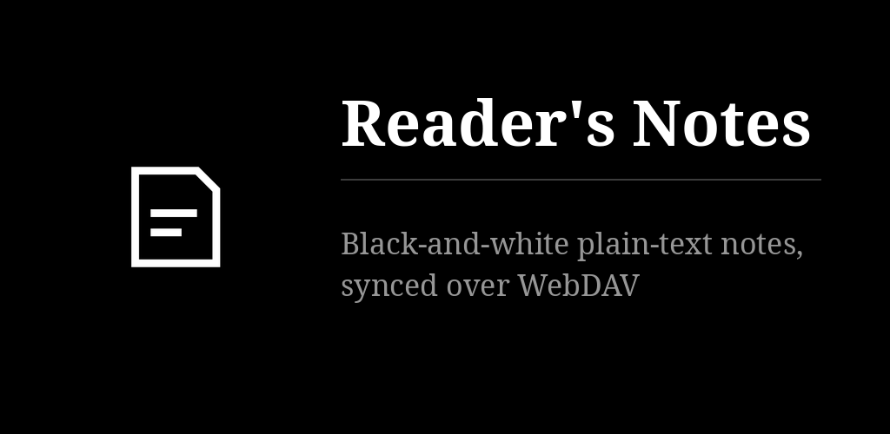
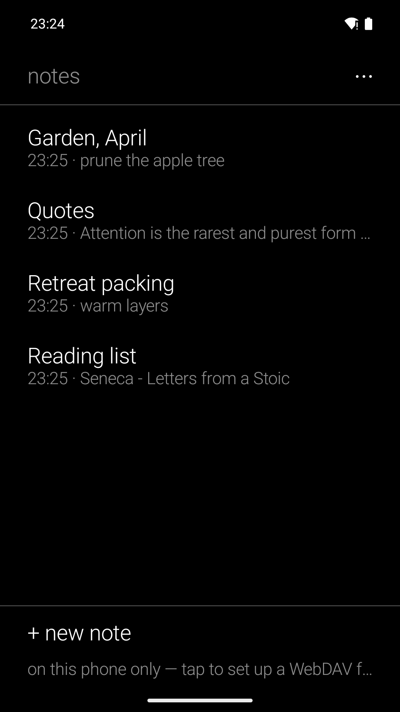
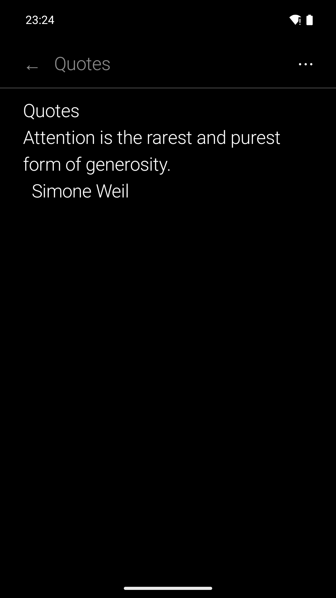

# Reader's Notes

One list, one page: a note is a .txt file whose first line is its title. Type it or dictate
it — speech is written on the phone by [whisper.cpp](https://github.com/ggerganov/whisper.cpp),
nothing is uploaded. Optional two-way sync with your own WebDAV folder (kDrive, Nextcloud…).
No formatting, no folders, no account. In the family of
[Reader's Launcher](https://github.com/funkypitt/readers-launcher).

## Key points

* Tap a note to write, long press to share or delete. The ⋯ menu finds, syncs and flips white
  on black. Text shared from another app becomes a new note.
* Two rows under the list and under every open note: **+ new note** to write, **● dictate** to
  speak. ■ ends it; the words arrive where the cursor is. The microphone stays open with the screen off.
* The speech model is fetched once (574 MB by default; a 190 MB one, four times faster, in the
  settings) and shared with Reader's Recorder, Audio Player and Podcasts. The sound is deleted
  once its text is in the note.
* Sync: one `.txt` per note in a WebDAV folder (default `Notes`), set in the four lines at the
  top of the settings. It runs when the app opens, when a note is left, and from the ⋯ menu.
* A note changed on both sides keeps the server's text as a second note ("… (server copy)").
  The status line under the list says what happened.
* Phone numbers, mail addresses and links in a note are offered in its ⋯ menu ("call …",
  "write to …", "open …"); the dialer never calls by itself.
* The network is used for your WebDAV server and the model download only. Credentials export
  and import as a file for another device or the desktop app.
* Two home-screen widgets (latest note, latest notes). For a launcher,
  `content://com.freedomfighter.readersnotes/notes/dictate` (VIEW) opens a new note, microphone open.

More detail: [docs/NOTES.md](docs/NOTES.md).

## Install

From the [F-Droid repo](https://funkypitt.github.io/fdroid-repo/) or the APK attached to a
release.

## Build

Clone with `--recursive`: the speech code is the git submodule `speech/`
([readers-speech](https://github.com/funkypitt/readers-speech)). Then `./gradlew assembleDebug`
(JDK 17+, Android SDK 35, NDK 27.1, CMake 3.22.1).

## Crédits / Credits

© 2026 Pierre Gallaz. Développé avec [Claude Code](https://claude.com/claude-code) (Anthropic).
Licence MIT, voir `LICENSE`.

© 2026 Pierre Gallaz. Developed with [Claude Code](https://claude.com/claude-code) (Anthropic).
MIT licence, see `LICENSE`.

## Captures d'écran

 
